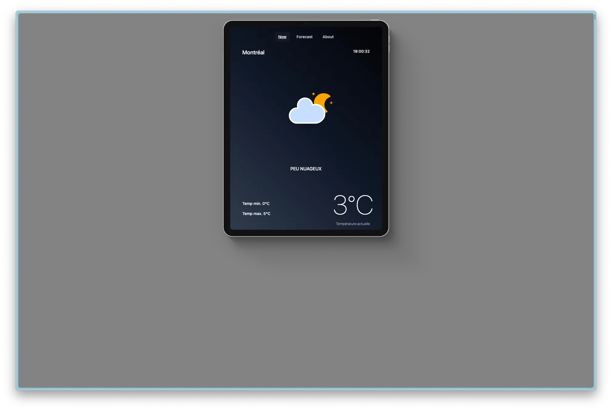
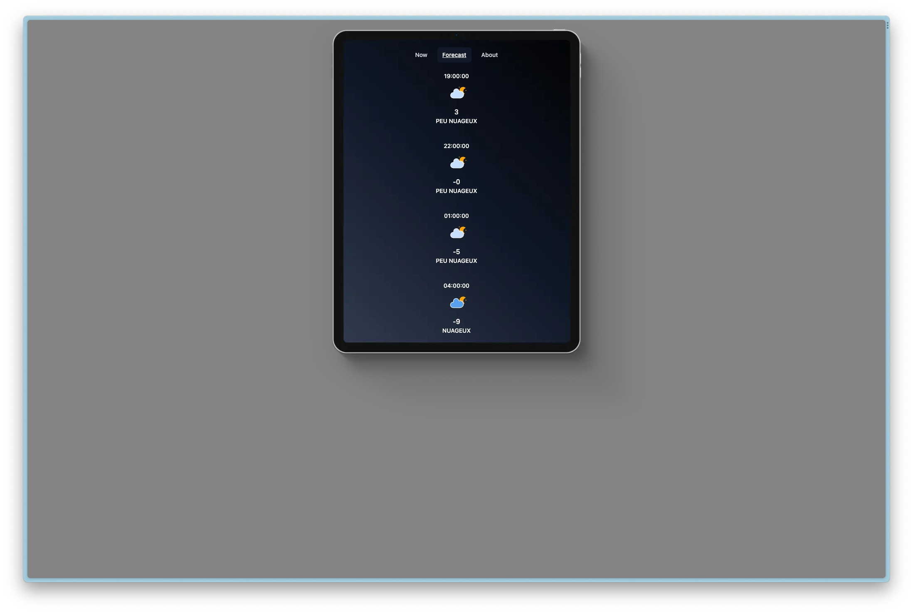
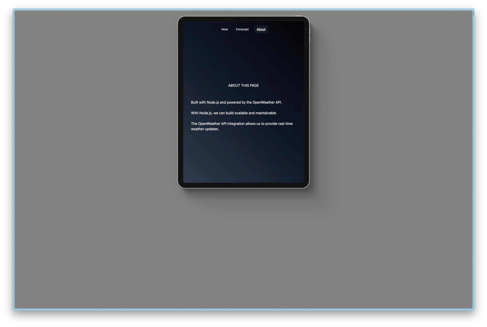

# TP Single page application

Pour ce projet, il nous est demandé de créer une single page application avec REst

## Contraintes

-   Créer un serveur node js
-   Récupérer les données depuis une API de notre choix, il faut une api avec une key api
-   Enregistrer les informations de connexions dans un fichier .env
-   Enregistrer la réponse dans un fichier JSON
-   Au lancement du serveur, le fichier JSON doit être mis à jour
-   Créer des pages pour afficher différentes informations que l'api nous renvoie
-   La navigation doit se faire sans refrech de la page

## Autres

Pour ce projet j'ai utilisé l'api d'OpenWeatherMap, j'ai utilisé aussi Axios pour les promesses HTTPS et Tailwind CSS pour le style

# TP Single page application

For this project, we are asked to create a single page application with REST

## Constraints

-   Create a node js server
-   Retrieve data from an API of our choice, you need an api with an api key
-   Save connection information in an .env file
-   Save the response in a JSON file
-   When launching the server, the JSON file must be updated
-   Create pages to display different information that the API sends back to us
-   The navigation must be done without refreshing the page

## Others

For this project I used the OpenWeatherMap API, I also used Axios for HTTPS promises and Tailwind CSS for styling

